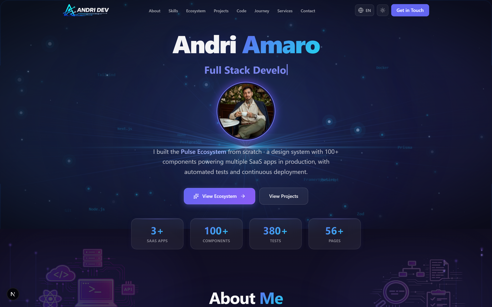
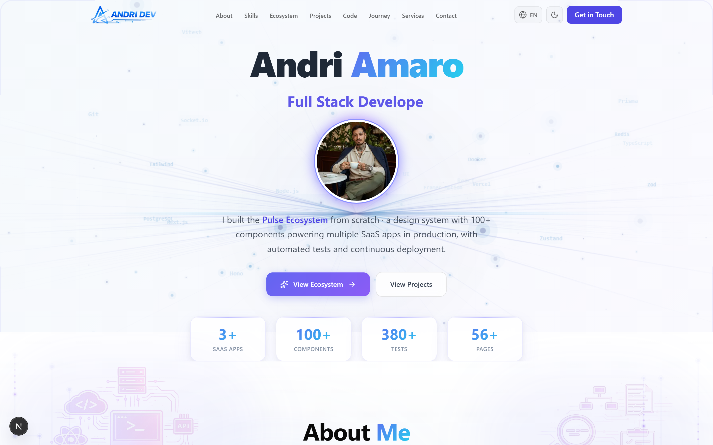
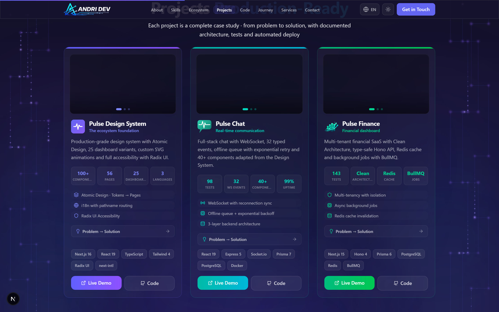
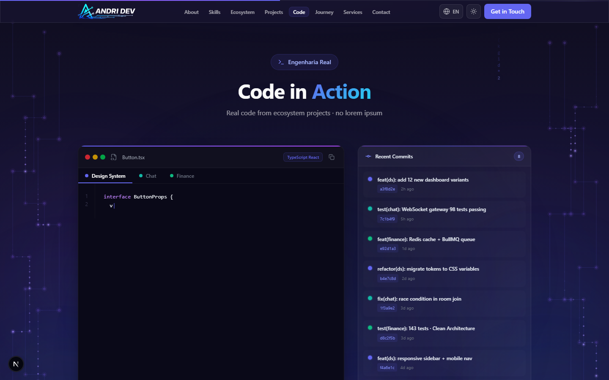
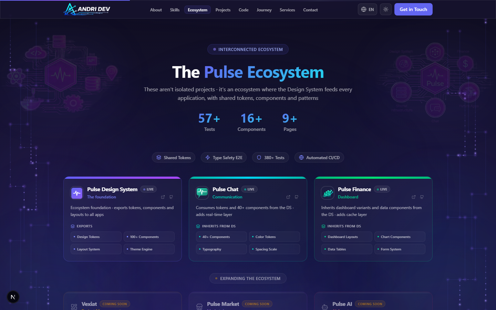
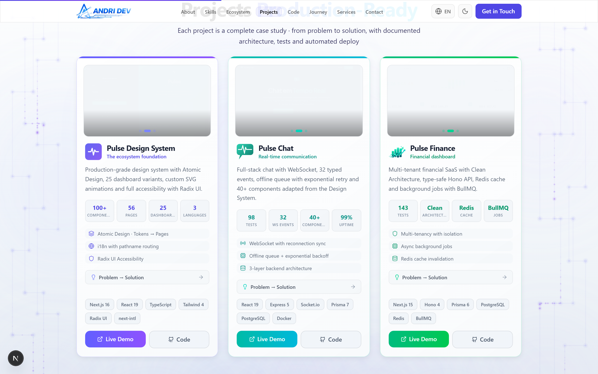
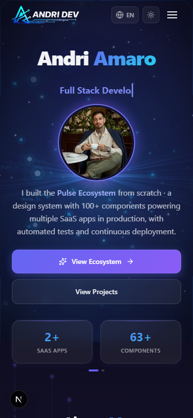
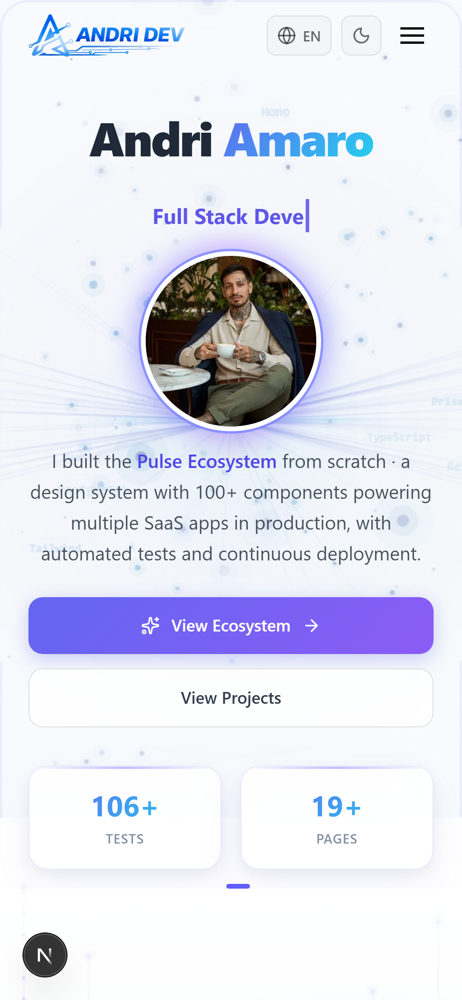

<div align="center">

# Andri Amaro · Full Stack Developer

**Creator of the Pulse Ecosystem · A unified design system powering multiple production SaaS apps**

[](https://portfolio-andriyamaros-projects.vercel.app)
[](https://github.com/AndriyAmaro)
[](https://www.linkedin.com/in/andri-amaro)


</div>

<br />

<div align="center">
  
  <br /><br />
  
</div>

<br />

## About This Project

A personal portfolio built to reflect how I think about software — from component architecture to deployment pipelines. Every section is a working example of the tools and patterns I use daily across the **Pulse Ecosystem**, a suite of interconnected apps sharing a unified design system.

### The Numbers

| Metric | Count |
|--------|-------|
| Production SaaS Apps | **3** |
| UI Components | **100+** |
| Automated Tests | **380+** |
| Pages Built | **56+** |
| Git Commits | **847+** |
| Lines of Code | **52k+** |

<br />

## Ecosystem Overview

The portfolio showcases three production apps, all powered by a shared design system:

```
                    ┌─────────────────────────┐
                    │   Pulse Design System   │
                    │   100+ components       │
                    │   Tokens · Layouts      │
                    │   Dark/Light · i18n     │
                    └────────┬────────────────┘
                             │
              ┌──────────────┼──────────────┐
              │              │              │
     ┌────────▼───────┐ ┌───▼──────────┐ ┌─▼──────────────┐
     │  Pulse Chat    │ │Pulse Finance │ │  Coming Soon   │
     │  Real-time     │ │  Dashboard   │ │  Vexiat        │
     │  WebSocket     │ │  Clean Arch  │ │  Pulse Market  │
     │  98 tests      │ │  143 tests   │ │  Pulse AI      │
     └────────────────┘ └──────────────┘ └────────────────┘
```

### Pulse Design System
The foundation. 100+ components, 25 dashboards, 3 languages, dark/light mode, built with Next.js 16, React 19, TypeScript, Tailwind 4, and Radix UI.

### Pulse Chat
Real-time communication app with 32 typed WebSocket events, offline queue with exponential backoff, and a 3-layer backend architecture. Built with Express 5, Socket.io, Prisma, and PostgreSQL.

### Pulse Finance
Financial dashboard with Clean Architecture, multi-tenancy isolation, Redis caching, and BullMQ background jobs. Built with Hono 4, Prisma, PostgreSQL, and Redis.

<br />

## Screenshots

<div align="center">
  
  <br /><br />
  
  <br /><br />
  
</div>

<details>
<summary><strong>Light Mode</strong></summary>
<br />
<div align="center">
  
</div>
</details>

<details>
<summary><strong>Mobile Preview</strong></summary>
<br />
<div align="center">
  
  &nbsp;&nbsp;&nbsp;&nbsp;
  
</div>
</details>

<br />

## Sections

| # | Section | Description |
|---|---------|-------------|
| 1 | **Hero** | Animated avatar with typing role rotation, live metrics carousel, and radial starburst animation |
| 2 | **About** | Engineering highlights (architecture, testing, documentation, CI/CD) with tech stack marquee |
| 3 | **Skills** | 25+ technologies across Frontend, Backend, and DevOps with proficiency levels |
| 4 | **Projects** | Deep-dive cards for each app with problem/solution narratives and real metrics |
| 5 | **Code in Action** | Live typing animation cycling through real code from all 3 projects with syntax highlighting |
| 6 | **Timeline** | Journey from first line of code to full ecosystem, with animated connector lines |
| 7 | **Ecosystem** | Interactive map showing how all apps connect through the shared design system |
| 8 | **Services** | Frontend, Backend, Full Stack, and Design System offerings with delivery process |
| 9 | **Contact** | Form with Zod validation, Resend email integration, and rate limiting |

<br />

## Tech Stack

### Frontend
- **Next.js 16** · App Router, Turbopack, static generation
- **React 19** · Latest features and concurrent rendering
- **TypeScript 5** · Strict mode, full type coverage
- **Tailwind CSS 4** · Utility-first with custom design tokens
- **Framer Motion 12** · Page transitions, scroll animations, micro-interactions

### Backend
- **Edge Runtime** · Serverless contact API on Vercel Edge
- **Zod 4** · Runtime validation on all inputs
- **Resend** · Transactional email delivery
- **Rate Limiting** · IP-based throttling (5 req/min)

### UI & Animation
- **Canvas API** · Custom circuit-trace backgrounds and Matrix code rain
- **Glassmorphism** · Backdrop blur, gradient borders, layered shadows
- **Geist Font** · Typography by Vercel
- **Lucide Icons** · Consistent icon system

### Infrastructure
- **Vercel** · Edge deployment, automatic previews
- **GitHub Actions** · CI pipeline
- **Turbopack** · Fast builds (2.9s production compile)

<br />

## Project Structure

```
portfolio/
├── src/
│   ├── app/
│   │   ├── api/contact/         # Edge API with Zod + rate limiting
│   │   ├── globals.css          # Design tokens + 2600+ lines of custom CSS
│   │   ├── layout.tsx           # Root layout, metadata, JSON-LD schema
│   │   ├── opengraph-image.tsx  # Dynamic OG image generation
│   │   └── page.tsx             # Single-page composition
│   │
│   ├── components/
│   │   ├── layout/              # Header (scroll-aware) + Footer
│   │   ├── sections/            # 9 full sections (Hero → Contact)
│   │   └── ui/                  # 18 reusable components
│   │       ├── AbstractBackground.tsx      # Canvas circuit-trace animation
│   │       ├── CodeInActionBackground.tsx  # Matrix code rain canvas
│   │       ├── FuturisticBackground.tsx    # Radial starburst for Hero
│   │       ├── SectionDivider.tsx          # Animated gradient dividers
│   │       └── ...                         # Button, Card, Badge, Input, etc.
│   │
│   ├── data/                    # Skills, projects, timeline entries
│   ├── hooks/                   # Custom React hooks
│   ├── lib/                     # Utilities (cn, validation, rate-limit)
│   └── types/                   # Shared TypeScript definitions
│
├── public/                      # Optimized images and static assets
└── .github/screenshots/         # README screenshots
```

<br />

## Getting Started

```bash
# Clone
git clone https://github.com/AndriyAmaro/portfolio.git
cd portfolio

# Install
npm install

# Dev server
npm run dev
```

Open [http://localhost:3000](http://localhost:3000).

### Environment Variables (Optional)

```env
RESEND_API_KEY=re_...    # For contact form email delivery
```

The site works fully without env vars — the contact form will validate and respond, but won't send emails.

<br />

## Deployment

Deployed on **Vercel** with automatic production deploys on every push to `master`. Turbopack builds complete in ~11 seconds.

```
Build: 2.9s compile · 0 TypeScript errors · 9 static pages
Runtime: 0 errors in production (last 7 days)
```

<br />

## Related Repositories

| Project | Description | Stack |
|---------|-------------|-------|
| [Pulse Design System](https://github.com/AndriyAmaro/pulse-ds) | 100+ components, tokens, layouts | Next.js, Radix UI, Tailwind |
| [Pulse Chat](https://github.com/AndriyAmaro/realtime-chat) | Real-time messaging with WebSocket | Express, Socket.io, PostgreSQL |
| [Pulse Finance](https://github.com/AndriyAmaro/finance-flow) | Financial dashboard | Hono, Prisma, Redis, BullMQ |

<br />

## License

MIT

<br />

<div align="center">

**Built with Next.js, TypeScript, and obsessive attention to detail.**

[](https://portfolio-andriyamaros-projects.vercel.app)

</div>
